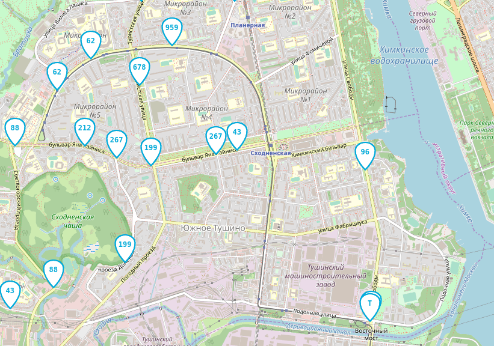

# Передвижение автобусов

Веб-приложение показывает передвижение автобусов на карте.



## Как запустить

- понадобится Python версии 3.7 или выше
```
pip install -r requirements.txt
```
```
cd backend/
```
Для запуска сервера
```
python server.py
```
Для запуска иммитатора gps данных
```
python bus_emulator/fake_bus.py
```
Сервер и иммитатор имеют дополнительные настройки. Подробней:
```
python server.py --help
python fake_bus.py --help
```

Для запуска тестов
```
python3 -m pytest tests/
```
- Откройте в браузере файл index.html для просмотра передвижений автобусов

## Цели проекта

Код написан в учебных целях — это урок в курсе по Python и веб-разработке на сайте [Devman](https://dvmn.org).
